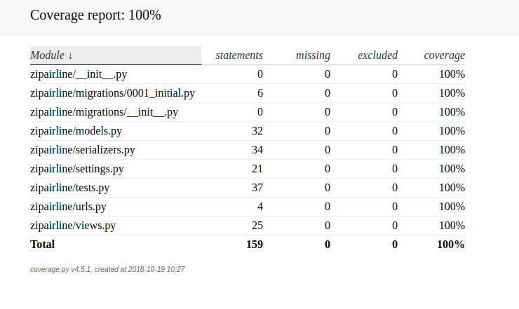

ZipAirlines
---

### Procedures

1. Build environment by virtualenv
```buildoutcfg
    virtualenv -p python3 venv
    source venv/bin/activate
    pip install -r requirements.txt
```

2. Start Project
```buildoutcfg
    python manager.py runserver
```

3. Testing (Adding project directory into venv path)
```buildoutcfg
    python manager.py test zipairline/
```

### Models

1. ZipAirplane
    - airplane_id: id of Airplane.
    - passenger_numb: number of passengers on Airplane
    - airline: Primary Key, connection to table ZipAirline
    - fuel_tank: Property of Airplane
    - fly_time: Property of Airplane
    - total_consumption_per_minute: Property of Airplane

2. ZipAirline
    - airline_name: name of Airline
    - total_consumption: Property of Airline
    - total_fly_time: Property of Airline
    

### Coverage

